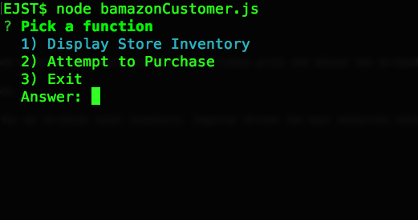

# sqlStorefront

Bamazon is a node.js application for putting a basic command-line interface in front of a user to view inventory, choose and item and quantity and then calculate the purchase price and adjust the on-hand inventory to the correct amount for the next purchase.

I made it a one file .js application with a MySQL back end. I emulated a store like Amazon or Target with several categories of goods.

For displaying the inventory available I integrated an NPM module called better-console that gives me a colorful table view output for my in-stock total inventory. Inquirer drives the user selection choice menus and the MySql module handles the database connection.

The app starts by offering 3 choices.
    1. Display Inventory
    2. Attemp Purchase
    3, Exit

The display inventory runs a table output of the whole database with all relevant details.

The purchase function has several embedded callback functions. It starts with asking for an item and quantity. If the requested quantity exceeds instock, you'll see an error. Otherwise it takes your item and quantity, calculates the total price based on item cost and then calls a function to adjust the inventory. Lastly, it returns you to the previous menu. When you call the inventory function you will see it adjusted.

Walkthrough Video:

ScreenShots:  

<!-- Format: ![App Start] -->

Future Enhancements:
A Manager view to adjust inventory levels
A Supervisor View to report on popular purchases

Challenges:
I ended up in a flurry of asynchonus chaos and (thanks to T.A. assistance) was rescused from "Callback Hell" and hope to make my future attempts easier.